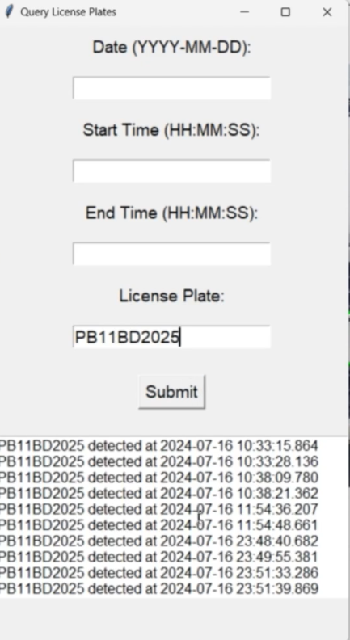
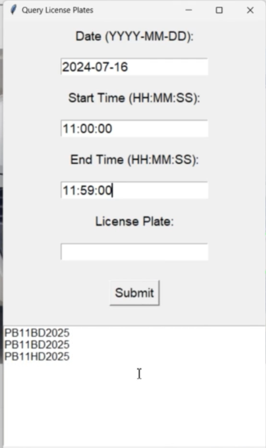

# Automatic-License-Plate-Recognition
This ALPR system uses YOLOv5 and EasyOCR for real-time vehicle detection and character recognition, with error correction, pattern matching, and Tkinter GUI, storing results in a queryable CSV file.

## Features

- **Real-Time Video Processing**: Detect and recognize license plates from live video feeds.
- **License Plate Recognition**: Uses EasyOCR for character recognition.
- **Data Logging**: Logs detected license plates with timestamps into a CSV file.
- **Query System**: Search detected plates by date, time, and number.
- **User-Friendly GUI**: Control the system and view results easily.
- **Image Preprocessing**: Includes functions for sharpening images and applying CLAHE (Contrast Limited Adaptive Histogram Equalization).
- **Image and Annotation Augmentation**: Applies various augmentations to images and updates corresponding annotations, including techniques like horizontal flip, random brightness/contrast adjustments, blur, rotation, RGB shift, and safe cropping.

## Dataset

Download the dataset used for training the YOLOv5 model from the following link:

[Dataset Link](https://www.kaggle.com/datasets/saisirishan/indian-vehicle-dataset)

## Dataset Augmentation Process

To enhance the training dataset and improve the model's generalization, we applied several data augmentation techniques to the images and annotations. Below is an explanation of the augmentation process:
We used the `albumentations` library to apply the following transformations:
- **Horizontal Flip**: Randomly flips images horizontally to simulate different orientations.
- **Brightness/Contrast Adjustment**: Adjusts the brightness and contrast to account for varying lighting conditions.
- **Blur**: Applies a random blur effect to simulate motion or focus imperfections.
- **Rotation**: Randomly rotates the image within a range of ±15 degrees.
- **RGB Shift**: Shifts the RGB channels to simulate different lighting environments.
- **Safe Cropping**: Crops the image safely around objects without losing significant details

# Application Screenshots

### 1. Real-Time License Plate Detection
  
  
*Description: Screenshot showing real-time vehicle detection and license plate recognition.*

### 2. Query System GUI
  
  
*Description: The GUI interface for searching detected license plates by date, time, or number.*

  
